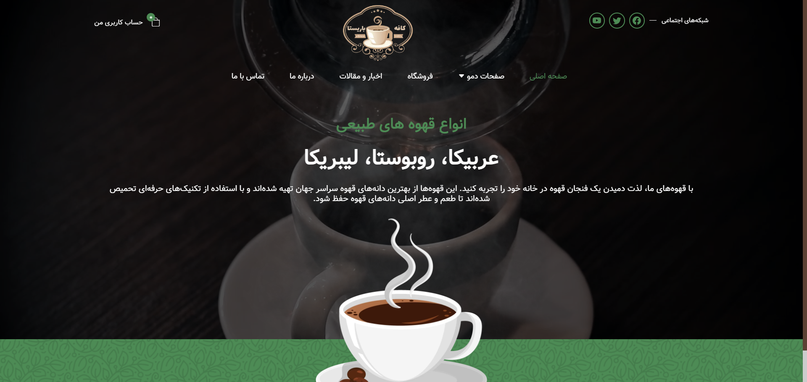

# Barista Café Website

This project is a sample website for **Barista Café**, designed to showcase the aesthetic and services of a coffee shop. The website is fully responsive and hosted on GitHub, providing a seamless user experience across all devices. 

## Live Demo

Check out the live version of this project [here](https://mehrangholami1384.github.io/barista).

[](https://mehrangholami1384.github.io/barista)

Explore the responsive design, modern layout, and smooth navigation in the live demo.

## Technologies Used

This project is built with the following technologies:

- **HTML**: Provides structure and accessibility for the website.
- **CSS**: Used for styling and creating a visually appealing experience.
- **Bootstrap**: Ensures a responsive layout and includes pre-styled components.
- **JavaScript** and **jQuery**: Add interactivity and dynamic functionality.

## Features

- **Fully Responsive Design**: Adaptable for desktop, tablet, and mobile views.
- **Smooth Navigation**: Simplified layout with an easy-to-navigate interface.
- **Modern Aesthetics**: A visually appealing design to represent the coffee shop’s brand.

## Project Structure

The folder structure of this project includes:

- `index.html`: The main page file containing the homepage layout and structure.
- `css/`: Contains custom CSS files as well as Bootstrap CSS for styling.
- `js/`: Includes JavaScript and jQuery files for interactive features.
- `img/`: Directory for images used throughout the website.

## Getting Started

To run the project locally, follow these steps:

1. Clone the repository:
   ```bash
   git clone https://github.com/MehranGholami1384/barista.git

2. **Download through this link** :
     [Download the Project](https://github.com/MehranGholami1384/barista/archive/refs/heads/main.zip)
